<!-- textura-banner -->
<div align="center">
  <a href="https://github.com/beepboop2025/groundcheck"></a>
</div>

# Groundcheck

[](https://x402-list.com/services/groundcheck?utm_source=badge&utm_medium=referral&utm_campaign=embed)


**The grounding check agents run before they commit to an answer.**

Groundcheck verifies a factual claim against live sources and returns a **verdict**, a
**confidence score**, and **citations**. Any agent — Claude Code, Cursor, your own — can call
it mid-task, before it states a fact it isn't sure of.

It is also a **verification layer for agentic commerce**: when an agent pays another
service over x402, `attest_delivery` verifies what was delivered against what was
advertised and issues a signed, offline-verifiable **delivery receipt** binding payment →
delivery → grounded content — the neutral accountability trail the a2a-payments
literature calls the missing layer ([docs/delivery-attestation.md](docs/delivery-attestation.md)).

## Architecture

Two parts, each in the language that fits it:

```
server/   TypeScript MCP server   — thin protocol layer (stdio). Holds no logic.
engine/   Python FastAPI service  — retrieval + stance classification + the verdict brain.
```

The MCP server is spawned by your client over stdio and talks to the engine over HTTP
(`GROUNDCHECK_ENGINE_URL`, default `http://127.0.0.1:8723`). The engine is the single source
of truth for how a verdict is reached, and it classifies source stance through the canonical
Python [`free-llm-router`](https://github.com/beepboop2025/free-llm-router) (free-tier providers).

```
verify_claim ─▶ TS MCP server ─HTTP▶ Python engine
                                        ├─ retrieval  (Wikipedia, keyless; or your own search)
                                        ├─ stance     (free-llm-router → supports/refutes/neutral)
                                        └─ verdict    (refuses on conflict, saturating confidence)
```

## Tools

| Tool | Use it when | Returns |
|------|-------------|---------|
| `verify_claim(claim, maxSources?)` | About to assert a fact you're unsure of | `{ verdict, confidence, rationale, sources }` |
| `check_citations(text, maxClaims?)` | Before publishing an AI-generated draft | per-claim verdict report |
| `attribution_badge()` | Want to mark content as checked | a Markdown badge |
| `resolve_instrument(query, idType?, maxResults?)` | Text names a security and you need to know exactly which one | canonical FIGI records + provenance (Bloomberg open symbology) |
| `extract_claims(text, maxClaims?)` | Want to see which claims a document makes before paying to ground them | atomic checkable claims + a signed receipt bound to the input hash |
| `attest_delivery(service, response_text, …)` | You paid another service over x402 and will act on (or account for) its output | a signed **delivery receipt** binding payment → delivery → grounded content ([docs](docs/delivery-attestation.md)) |

`verdict` is one of `supported` · `refuted` · `unverified`. Each verdict also
carries a `sufficiency` tag (`sufficient` · `insufficient` · `no_sources` ·
`no_stance` · `conflict`) so an agent can tell "I found nothing" from "sources
exist but don't establish it" from "sources disagree" — the three ways an
abstention happens carry different meaning and are no longer collapsed
([SURE-RAG](https://arxiv.org/abs/2605.03534)).

**Compound claims are decomposed.** A claim like _"Marie Curie won two Nobel
Prizes and was born in Paris"_ is split into atoms
([Fact in Fragments](https://arxiv.org/abs/2506.07446)), each verified on its
own evidence and recombined weakest-link: one false part refutes the whole, one
unproven part blocks a `supported`. The true half can no longer carry the false
half past the check. The atom breakdown is returned in `atoms`. (Decomposition
is rule-based and high-precision — it splits only on clean conjunction
boundaries and otherwise leaves the claim whole; disable with
`GROUNDCHECK_DECOMPOSE=0`.)

**Remote MCP (no install):** add `https://groundcheck.seiche.info/mcp` as a remote MCP server (Claude/ChatGPT/Cursor connectors, or a gateway like Smithery/Glama). Speaks streamable-HTTP JSON-RPC; `verify_claim` is free, the paid tools answer HTTP 402 with an x402 offer.

## Quickstart

The MCP server **auto-starts the Python engine** if one isn't already running, so a single
registration is enough — no separate process to babysit.

```bash
make install                      # deps for both halves (pip + npm)
npm --prefix server run build     # compile the server
export GROQ_API_KEY="gsk_..."     # one free key for stance classification (Groq: ~2 min, 14,400/day)

# register with your MCP client — the engine spawns on first use and stops with the server
claude mcp add groundcheck -- node "$PWD/server/dist/server.js"
```

Already running the engine yourself (`make engine` or `docker compose up -d`)? The server
detects and **reuses** it — and won't touch an engine it didn't start. Set
`GROUNDCHECK_NO_SPAWN=1` to stop it from ever spawning one.

> Once published to npm, registration becomes `claude mcp add groundcheck -- npx -y groundcheck-mcp`.
> Auto-spawn needs a local `engine/` + Python deps; for an npx-only install, run the engine via
> `docker compose up -d` and the server connects to it over `GROUNDCHECK_ENGINE_URL`.

With **no** provider key the engine still runs — retrieval works, but every verdict is
`unverified`. It degrades honestly: a disabled backend, a missing key, or conflicting sources
all flow toward `unverified`. An unconfigured Groundcheck **cannot** return `supported`.

> Note: OpenRouter's `:free` models are quota-throttled (HTTP 429) and make a poor sole
> provider. Prefer Groq or Cerebras for the fast classification tier.

## Why grounded verdicts, not LLM-judgment

Asking an LLM to *judge* whether a claim is true is unreliable in a way that's easy to miss.
In **TraderBench** (Yuan et al., 2026), the *same* candidate responses re-scored by three
frontier LLM judges swung by ~29 points on the knowledge-retrieval section — while the
performance-grounded section, whose scoring is anchored to verifiable computation, swung 0.3.
The lesson: **the more you constrain a judgment with external evidence, the less it varies.**

Groundcheck is built on that principle. It never asks a model "is this true?" from parametric
memory. Instead it:

- **retrieves** sources first, then asks only the narrow, evidence-anchored question — does
  *this cited passage* support, refute, or stay neutral on the claim (stance classification);
- **refuses on conflict** and saturates confidence, so disagreement flows to `unverified`
  rather than a confident guess;
- **returns citations**, so the verdict is checkable, not taken on the model's word.

That's the difference between an LLM judge and a grounding check: the judge's discretion is the
product; here it's deliberately fenced in by retrieved evidence.

## Calibrated verdicts: the "error ≤ α" guarantee

A confidence number without a promise attached is just vibes with decimals. When a
calibration artifact is deployed, Groundcheck attaches a `guarantee` object to
directional verdicts, built with **split conformal prediction** (adapted from
*Multi-LLM Adaptive Conformal Inference*, arXiv:2602.01285):

- Stance classification runs as a **panel**: up to `GROUNDCHECK_ENSEMBLE_MAX` free
  providers judge the claim independently (different model families disagree on
  *which* claims they get wrong, so the ensemble beats any one of them). Per-source
  stances are majority-voted; each panelist also emits a probability the claim is
  true given only the snippets, combined into a weighted `ensemble_score`.
- `scripts/calibrate.py` runs the real pipeline over a labeled claim set and stores
  finite-sample thresholds per claim group (`instrument` / `general`, `global`
  fallback) in `calibration/calibration.json`.
- A verdict is **certified** (`guarantee.certified: true`) only when its score
  clears the threshold. The math guarantees that, for claims exchangeable with the
  calibration set, a **false claim is certified `supported` with probability ≤ α**
  (default 0.1), and symmetrically for `refuted`. No distributional assumptions,
  exact in finite samples.

Honest degradation, as everywhere else: no artifact → no guarantee is ever claimed;
too little calibration data for a given α → the threshold is refused rather than
extrapolated. The guarantee is only as good as the exchangeability assumption —
recalibrate with domain claims before leaning on it in a new domain.

## Configuration (engine)

| Var | Default | Purpose |
|-----|---------|---------|
| `GROUNDCHECK_SEARCH_BACKEND` | _(unset)_ | `stub` to disable real retrieval |
| `GROUNDCHECK_SEARCH_URL` | Wikipedia | custom JSON search endpoint (`{results:[{title,url,snippet,stance?}]}`) |
| `GROUNDCHECK_SEARCH_KEY` | — | bearer token for the custom endpoint |
| `GROUNDCHECK_ROUTER_PATH` | sibling checkout | path to the `free-llm-router` Python package |
| `GROUNDCHECK_ENGINE_HOST` / `_PORT` | `127.0.0.1` / `8723` | engine bind address |
| `GROQ_API_KEY` _(or any router provider key)_ | — | enables stance classification |
| `GROUNDCHECK_ENSEMBLE` | `1` | multi-provider stance panel (`0` = single-router) |
| `GROUNDCHECK_ENSEMBLE_MAX` | `3` | max concurrent panelists per claim |
| `GROUNDCHECK_CALIBRATION` | `calibration/calibration.json` | conformal artifact path |

### Machine-payable hosting (x402)

A hosted engine can charge AI agents per call in USDC over the
[x402 protocol](https://x402.org) — HTTP 402 + signed transfer authorization,
no accounts or API keys. Dormant unless `GROUNDCHECK_X402_PAY_TO` is set;
`/verify` stays free forever and is the way to evaluate output before paying;
the paid surface prices as a granular verification loop: **extract $0.005 → ground
$0.02 → delivery-attestation bundle $0.05** (plus `/resolve` at $0.005).
Both protocol generations (v1 and v2) are accepted, and agents can read the
offer at `GET /.well-known/x402`. Full operator guide: [docs/x402.md](docs/x402.md).

Server side:

| Var | Default | Purpose |
|-----|---------|---------|
| `GROUNDCHECK_ENGINE_URL` | `http://127.0.0.1:8723` | where the server finds the engine |
| `GROUNDCHECK_NO_SPAWN` | _(unset)_ | set to disable auto-spawning the engine |
| `GROUNDCHECK_ENGINE_DIR` | repo `engine/` | engine location for auto-spawn |
| `GROUNDCHECK_PYTHON` | `python3` | interpreter used to spawn the engine |
| `GROUNDCHECK_REPO_URL` | repo URL | URL used in the attribution footer/badge |

## Development

```bash
make test        # engine pytest (verdict rule + x402 gating) + server typecheck
make engine      # run the engine
make server      # run the MCP server in dev (tsx)
make build       # compile the server to server/dist
```

The interesting logic is in `engine/groundcheck_engine/verdict.py`: how much source
agreement counts as "supported," how conflict is handled, and how confidence saturates.

MIT.
