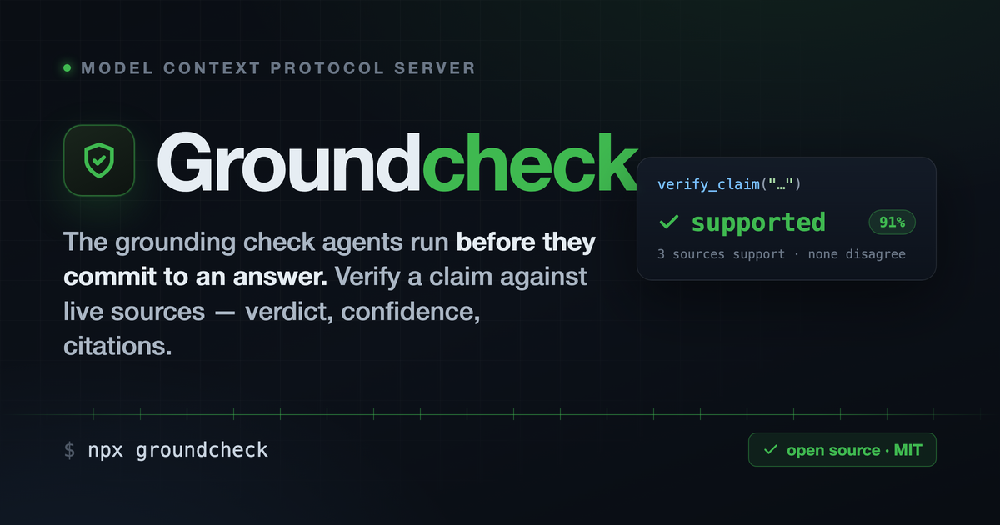

# Groundcheck



**The grounding check agents run before they commit to an answer.**

Groundcheck verifies a factual claim against live sources and returns a **verdict**, a
**confidence score**, and **citations**. Any agent — Claude Code, Cursor, your own — can call
it mid-task, before it states a fact it isn't sure of.

## Architecture

Two parts, each in the language that fits it:

```
server/   TypeScript MCP server   — thin protocol layer (stdio). Holds no logic.
engine/   Python FastAPI service  — retrieval + stance classification + the verdict brain.
```

The MCP server is spawned by your client over stdio and talks to the engine over HTTP
(`GROUNDCHECK_ENGINE_URL`, default `http://127.0.0.1:8723`). The engine is the single source
of truth for how a verdict is reached, and it classifies source stance through the canonical
Python [`free-llm-router`](https://github.com/beepboop2025/free-llm-router) (free-tier providers).

```
verify_claim ─▶ TS MCP server ─HTTP▶ Python engine
                                        ├─ retrieval  (Wikipedia, keyless; or your own search)
                                        ├─ stance     (free-llm-router → supports/refutes/neutral)
                                        └─ verdict    (refuses on conflict, saturating confidence)
```

## Tools

| Tool | Use it when | Returns |
|------|-------------|---------|
| `verify_claim(claim, maxSources?)` | About to assert a fact you're unsure of | `{ verdict, confidence, rationale, sources }` |
| `check_citations(text, maxClaims?)` | Before publishing an AI-generated draft | per-claim verdict report |
| `attribution_badge()` | Want to mark content as checked | a Markdown badge |

`verdict` is one of `supported` · `refuted` · `unverified`.

## Quickstart

The MCP server **auto-starts the Python engine** if one isn't already running, so a single
registration is enough — no separate process to babysit.

```bash
make install                      # deps for both halves (pip + npm)
npm --prefix server run build     # compile the server
export GROQ_API_KEY="gsk_..."     # one free key for stance classification (Groq: ~2 min, 14,400/day)

# register with your MCP client — the engine spawns on first use and stops with the server
claude mcp add groundcheck -- node "$PWD/server/dist/server.js"
```

Already running the engine yourself (`make engine` or `docker compose up -d`)? The server
detects and **reuses** it — and won't touch an engine it didn't start. Set
`GROUNDCHECK_NO_SPAWN=1` to stop it from ever spawning one.

> Once published to npm, registration becomes `claude mcp add groundcheck -- npx -y groundcheck`.
> Auto-spawn needs a local `engine/` + Python deps; for an npx-only install, run the engine via
> `docker compose up -d` and the server connects to it over `GROUNDCHECK_ENGINE_URL`.

With **no** provider key the engine still runs — retrieval works, but every verdict is
`unverified`. It degrades honestly: a disabled backend, a missing key, or conflicting sources
all flow toward `unverified`. An unconfigured Groundcheck **cannot** return `supported`.

> Note: OpenRouter's `:free` models are quota-throttled (HTTP 429) and make a poor sole
> provider. Prefer Groq or Cerebras for the fast classification tier.

## Configuration (engine)

| Var | Default | Purpose |
|-----|---------|---------|
| `GROUNDCHECK_SEARCH_BACKEND` | _(unset)_ | `stub` to disable real retrieval |
| `GROUNDCHECK_SEARCH_URL` | Wikipedia | custom JSON search endpoint (`{results:[{title,url,snippet,stance?}]}`) |
| `GROUNDCHECK_SEARCH_KEY` | — | bearer token for the custom endpoint |
| `GROUNDCHECK_ROUTER_PATH` | sibling checkout | path to the `free-llm-router` Python package |
| `GROUNDCHECK_ENGINE_HOST` / `_PORT` | `127.0.0.1` / `8723` | engine bind address |
| `GROQ_API_KEY` _(or any router provider key)_ | — | enables stance classification |

Server side:

| Var | Default | Purpose |
|-----|---------|---------|
| `GROUNDCHECK_ENGINE_URL` | `http://127.0.0.1:8723` | where the server finds the engine |
| `GROUNDCHECK_NO_SPAWN` | _(unset)_ | set to disable auto-spawning the engine |
| `GROUNDCHECK_ENGINE_DIR` | repo `engine/` | engine location for auto-spawn |
| `GROUNDCHECK_PYTHON` | `python3` | interpreter used to spawn the engine |
| `GROUNDCHECK_REPO_URL` | repo URL | URL used in the attribution footer/badge |

## Development

```bash
make test        # engine pytest (8 cases on the verdict rule) + server typecheck
make engine      # run the engine
make server      # run the MCP server in dev (tsx)
make build       # compile the server to server/dist
```

The interesting logic is in `engine/groundcheck_engine/verdict.py`: how much source
agreement counts as "supported," how conflict is handled, and how confidence saturates.

MIT.
